## Prova Banco De Dados
## 1- Cenário

Uma loja localizada no centro da cidade estava passando por alguns problemas financeiros. A loja se chama SHOP TOY, uma loja que é especializada em brinquedos dos mais diversos tipos (para crianças desde as menores até as mais crescidas) e também para um público mais velho alguns artigos esportivos (como bolas das mais variadas, chuteiras e etc).
 O seu gerente resolveu que para o melhor funcionamento da loja seria necessário um novo sistema de banco de dados, pois o que eles utilizavam além de ter vários problemas também não estava sendo muito utilizado pelos funcionários tendo em vista as suas falhas. 
Você foi contratado para criar este sistema de uma forma que facilite a manipulação de dados no sistema da loja.
Além disso, o novo sistema de banco de dados da loja SHOP TOY deve ser capaz de gerenciar não apenas as vendas de produtos, mas também o estoque de mercadorias, o registro de clientes, as informações dos funcionários e a performance financeira da loja.

O sistema deve ser capaz de registrar todas as transações de compra e venda de produtos, mantendo um registro detalhado do histórico de compras de cada cliente. Isso inclui informações como data da compra, produtos adquiridos, valor total da compra e método de pagamento utilizado.

Para otimizar a gestão do estoque, o sistema deve manter um registro atualizado de todos os produtos disponíveis na loja, incluindo informações como quantidade em estoque, preço de venda, idade mínima recomendada para o produto (se aplicável) e qualquer desconto ou promoção em vigor.

Além disso, o sistema deve permitir o cadastramento e atualização de informações dos clientes e funcionários incluindo nome, data de nascimento, endereço, e-mail e número de telefone

## 2- Modelo Conceitual


## 3- Modelo Lógico
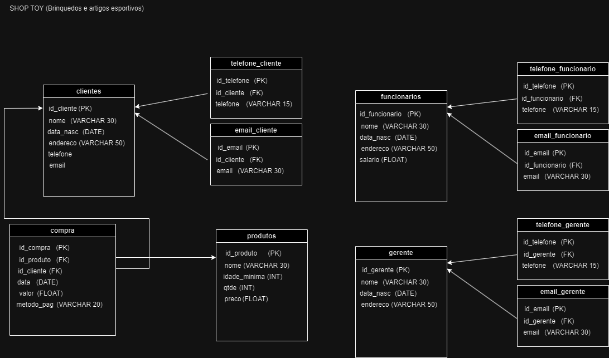

## 4- Modelo Físico 

```
CREATE DATABASE SHOP_TOY;
USE SHOP_TOY

//Criando a tabela clientes//

CREATE TABLE Clientes (
    id_cliente INT PRIMARY KEY,
    nome VARCHAR(30),
    data_nasc DATE,
    endereco VARCHAR(50),
    email VARCHAR(50),
    telefone VARCHAR(30)
);

//Criando a tabela Funcionarios//

CREATE TABLE Funcionarios (
    id_funcionario INT PRIMARY KEY,
    nome VARCHAR(30),
    data_nasc DATE,
    endereco VARCHAR(50),
    salario FLOAT
);

//Criando a tabela Produtos//

CREATE TABLE Produtos (
    id_produto INT PRIMARY KEY,
    nome VARCHAR(30),
    idade_minima INT,
    qtde INT,
    preco FLOAT
);

//Criando a tabela Gerente//

CREATE TABLE Gerente (
    id_gerente INT PRIMARY KEY,
    nome VARCHAR(30),
    data_nasc DATE,
    endereco VARCHAR(50),
    telefone VARCHAR(15),
    email VARCHAR(15)
);

//Criando a tabela Compras//

CREATE TABLE Compras (
    d_compra INT PRIMARY KEY,
    id_produto INT FOREIGN KEY REFERENCES Produtos(id_produto),
    id_cliente INT FOREIGN KEY REFERENCES Clientes(id_cliente),
    data DATE,
    valor FLOAT,
    metodo_pag VARCHAR(20)
);

```
## 5- Inserindo dados nas tabelas

```

use shop_toy;


INSERT INTO Clientes (id_cliente, nome, data_nasc, endereco, email, telefone) VALUES
    (1, 'Maria Oliveira', '1990-05-12', 'Rua das Flores, 123', 'maria@example.com', '1111-1111'),
    (2, 'João Santos', '1985-07-25', 'Av. Central, 456', 'joao@example.com', '2222-2222'),
    (3, 'Ana Pereira', '1982-09-18', 'Rua da Praia, 789', 'ana@example.com', '3333-3333'),
    (4, 'Pedro Silva', '1993-02-03', 'Rua dos Pássaros, 321', 'pedro@example.com', '4444-4444'),
    (5, 'Julia Costa', '1988-11-30', 'Av. Principal, 654', 'julia@example.com', '5555-5555'),
    (6, 'Lucas Souza', '1979-04-15', 'Rua das Árvores, 987', 'lucas@example.com', '6666-6666'),
    (7, 'Mariana Alves', '1995-08-08', 'Rua das Pedras, 147', 'mariana@example.com', '7777-7777'),
    (8, 'Fernanda Lima', '1980-01-21', 'Av. dos Anjos, 258', 'fernanda@example.com', '8888-8888'),
    (9, 'Rafael Santos', '1983-06-14', 'Rua dos Coqueiros, 369', 'rafael@example.com', '9999-9999'),
    (10, 'Carolina Oliveira', '1991-03-27', 'Av. das Rosas, 753', 'carolina@example.com', '1010-1010'),
    (11, 'Gabriel Pereira', '1976-10-20', 'Rua das Violetas, 852', 'gabriel@example.com', '1111-1111'),
    (12, 'Isabela Fernandes', '1997-05-03', 'Av. dos Girassóis, 159', 'isabela@example.com', '1212-1212'),
    (13, 'Thiago Almeida', '1989-08-16', 'Rua dos Cravos, 753', 'thiago@example.com', '1313-1313'),
    (14, 'Laura Costa', '1984-12-09', 'Av. das Margaridas, 357', 'laura@example.com', '1414-1414'),
    (15, 'Daniel Rodrigues', '1994-07-22', 'Rua dos Lírios, 951', 'daniel@example.com', '1515-1515'),
    (16, 'Patrícia Almeida', '1981-02-05', 'Av. dos Jasmins, 258', 'patricia@example.com', '1616-1616'),
    (17, 'Rodrigo Fernandes', '1990-11-18', 'Rua das Orquídeas, 753', 'rodrigo@example.com', '1717-1717'),
    (18, 'Aline Silva', '1987-04-07', 'Av. das Azaleias, 357', 'aline@example.com', '1818-1818'),
    (19, 'Guilherme Lima', '1982-09-30', 'Rua das Bromélias, 951', 'guilherme@example.com', '1919-1919'),
    (20, 'Camila Costa', '1996-06-13', 'Av. das Hortênsias, 258', 'camila@example.com', '2020-2020');

INSERT INTO Funcionarios (id_funcionario, nome, data_nasc, endereco, salario) VALUES
    (1, 'Carlos Oliveira', '1980-05-12', 'Rua das Oliveiras, 123', 3500),
    (2, 'Fernanda Silva', '1985-07-25', 'Av. Central, 456', 4000),
    (3, 'Rafaela Santos', '1982-09-18', 'Rua da Praia, 789', 3800),
    (4, 'Lucas Pereira', '1993-02-03', 'Rua dos Pássaros, 321', 4200),
    (5, 'Ana Costa', '1988-11-30', 'Av. Principal, 654', 3700),
    (6, 'Mariana Almeida', '1979-04-15', 'Rua das Árvores, 987', 3900),
    (7, 'Thiago Lima', '1995-08-08', 'Rua das Pedras, 147', 4100),
    (8, 'Patricia Souza', '1980-01-21', 'Av. dos Anjos, 258', 3600),
    (9, 'Rodrigo Fernandes', '1983-06-14', 'Rua dos Coqueiros, 369', 4300),
    (10, 'Larissa Oliveira', '1991-03-27', 'Av. das Rosas, 753', 3800),
    (11, 'Márcio Santos', '1976-10-20', 'Rua das Violetas, 852', 4000),
    (12, 'Fernanda Costa', '1997-05-03', 'Av. dos Girassóis, 159', 4200),
    (13, 'Pedro Almeida', '1989-08-16', 'Rua dos Cravos, 753', 3700),
    (14, 'Jéssica Rodrigues', '1984-12-09', 'Av. das Margaridas, 357', 3800),
    (15, 'Bruno Silva', '1994-07-22', 'Rua dos Lírios, 951', 3900),
    (16, 'Luana Costa', '1981-02-05', 'Av. dos Jasmins, 258', 4100),
    (17, 'Ricardo Santos', '1990-11-18', 'Rua das Orquídeas, 753', 4200),
    (18, 'Amanda Oliveira', '1987-04-07', 'Av. das Azaleias, 357', 3700),
    (19, 'Guilherme Fernandes', '1982-09-30', 'Rua das Bromélias, 951', 4000),
    (20, 'Tatiane Lima', '1996-06-13', 'Av. das Hortênsias, 258', 4300);

INSERT INTO Produtos (id_produto, nome, idade_minima, qtde, preco) VALUES
    (1, 'Boneca de Pelúcia', 0, 50, 29.99),
    (2, 'Carrinho de Controle Remoto', 3, 30, 49.99),
    (3, 'Quebra-Cabeça Infantil', 5, 40, 19.99),
    (4, 'Bola de Futebol', 6, 60, 15.99),
    (5, 'Kit de Pintura', 4, 20, 25.99),
    (6, 'Jogo de Tabuleiro', 8, 35, 39.99),
    (7, 'Patinete Infantil', 4, 45, 49.99),
    (8, 'Boneco Articulado', 3, 55, 29.99),
    (9, 'Blocos de Montar', 2, 70, 19.99),
    (10, 'Kit de Massinha de Modelar', 3, 25, 9.99),
    (11, 'Bicicleta Infantil', 5, 15, 99.99),
    (12, 'Puzzle 3D', 8, 20, 34.99),
    (13, 'Kit de Miniaturas', 6, 40, 29.99),
    (14, 'Pelúcia Interativa', 1, 30, 39.99),
    (15, 'Jogo de Argolas', 4, 25, 14.99),
    (16, 'Kit de Fantasias', 4, 20, 19.99),
    (17, 'Playset de Dinossauros', 3, 35, 24.99),
    (18, 'Kit de Instrumentos Musicais', 2, 50, 49.99),
    (19, 'Cubo Mágico', 6, 30, 9.99),
    (20, 'Kit de Brinquedos Educativos', 3, 40, 29.99);

INSERT INTO Gerente (id_gerente, nome, data_nasc, endereco, telefone, email) VALUES
    (1, 'Carla Silva', '1978-05-12', 'Rua das Flores, 123', '1111-1111', 'carla@example.com'),
    (2, 'Lucas Oliveira', '1983-07-25', 'Av. Central, 456', '2222-2222', 'lucas@example.com'),
    (3, 'Fernanda Santos', '1980-09-18', 'Rua da Praia, 789', '3333-3333', 'fernanda@example.com'),
    (4, 'Rafaela Costa', '1991-02-03', 'Rua dos Pássaros, 321', '4444-4444', 'rafaela@example.com'),
    (5, 'Pedro Almeida', '1986-11-30', 'Av. Principal, 654', '5555-5555', 'pedro@example.com'),
    (6, 'Ana Lima', '1977-04-15', 'Rua das Árvores, 987', '6666-6666', 'ana@example.com'),
    (7, 'Mariana Oliveira', '1992-08-08', 'Rua das Pedras, 147', '7777-7777', 'mariana@example.com'),
    (8, 'Thiago Fernandes', '1978-01-21', 'Av. dos Anjos, 258', '8888-8888', 'thiago@example.com'),
    (9, 'Rodrigo Santos', '1983-06-14', 'Rua dos Coqueiros, 369', '9999-9999', 'rodrigo@example.com'),
    (10, 'Larissa Costa', '1991-03-27', 'Av. das Rosas, 753', '1010-1010', 'larissa@example.com'),
    (11, 'Gabriel Almeida', '1976-10-20', 'Rua das Violetas, 852', '1111-1111', 'gabriel@example.com'),
    (12, 'Isabela Pereira', '1997-05-03', 'Av. dos Girassóis, 159', '1212-1212', 'isabela@example.com'),
    (13, 'Thiago Lima', '1989-08-16', 'Rua dos Cravos, 753', '1313-1313', 'thiago@example.com'),
    (14, 'Jéssica Rodrigues', '1984-12-09', 'Av. das Margaridas, 357', '1414-1414', 'jessica@example.com'),
    (15, 'Bruno Silva', '1994-07-22', 'Rua dos Lírios, 951', '1515-1515', 'bruno@example.com'),
    (16, 'Luana Costa', '1981-02-05', 'Av. dos Jasmins, 258', '1616-1616', 'luana@example.com'),
    (17, 'Ricardo Santos', '1990-11-18', 'Rua das Orquídeas, 753', '1717-1717', 'ricardo@example.com'),
    (18, 'Amanda Oliveira', '1987-04-07', 'Av. das Azaleias, 357', '1818-1818', 'amanda@example.com'),
    (19, 'Guilherme Fernandes', '1982-09-30', 'Rua das Bromélias, 951', '1919-1919', 'guilhe@example.com'),
    (20, 'Tatiane Lima', '1996-06-13', 'Av. das Hortênsias, 258', '2020-2020', 'tatiane@example.com');

INSERT INTO Compras (d_compra, id_produto, id_cliente, data, valor, metodo_pag) VALUES
    (1, 1, 1, '2024-06-01', 29.99, 'Cartão de Crédito'),
    (2, 3, 2, '2024-06-02', 19.99, 'Boleto Bancário'),
    (3, 5, 3, '2024-06-03', 25.99, 'Cartão de Débito'),
    (4, 7, 4, '2024-06-04', 49.99, 'Cartão de Crédito'),
    (5, 9, 5, '2024-06-05', 19.99, 'Boleto Bancário'),
    (6, 11, 6, '2024-06-06', 99.99, 'Cartão de Débito'),
    (7, 13, 7, '2024-06-07', 29.99, 'Cartão de Crédito'),
    (8, 15, 8, '2024-06-08', 14.99, 'Boleto Bancário'),
    (9, 17, 9, '2024-06-09', 24.99, 'Cartão de Débito'),
    (10, 19, 10, '2024-06-10', 49.99, 'Cartão de Crédito'),
    (11, 2, 11, '2024-06-11', 49.99, 'Boleto Bancário'),
    (12, 4, 12, '2024-06-12', 15.99, 'Cartão de Débito'),
    (13, 6, 13, '2024-06-13', 39.99, 'Cartão de Crédito'),
    (14, 8, 14, '2024-06-14', 29.99, 'Boleto Bancário'),
    (15, 10, 15, '2024-06-15', 9.99, 'Cartão de Débito'),
    (16, 12, 16, '2024-06-16', 34.99, 'Cartão de Crédito'),
    (17, 14, 17, '2024-06-17', 39.99, 'Boleto Bancário'),
    (18, 16, 18, '2024-06-18', 19.99, 'Cartão de Débito'),
    (19, 18, 19, '2024-06-19', 49.99, 'Cartão de Crédito'),
    (20, 20, 20, '2024-06-20', 29.99, 'Boleto Bancário');

```

## 6- Exemplos de CRUD

### Operação de leitura (Read):
``` SELECT * FROM Clientes; ```

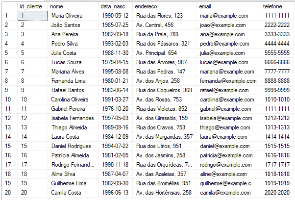

aqui pode-se selecionar todos os elementos e dados em uma tabela

### Operação de atualização (Update):
```
UPDATE Clientes
SET endereco = 'Av. das Palmeiras, 456'
WHERE id_cliente = 10;
```
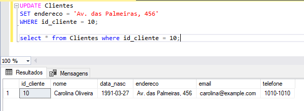

aqui pode-se atualizar dados de uma tabela já existente

### Operação de excluir (Delete):
```
DELETE FROM Clientes
WHERE id_cliente = 10;
```

aqui pode-se deletar dados de uma tabela

## 7- Relatórios

### Consulta 1: Consulta de Clientes por Endereço:
```
SELECT * FROM Clientes WHERE endereco LIKE '%Rua dos Cravos, 753' ORDER BY nome;
```
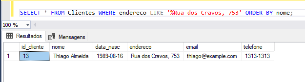

### Consulta 2: Consulta de Compras por Valor:
```
SELECT * FROM Compras WHERE valor < 15 ORDER BY valor;
```
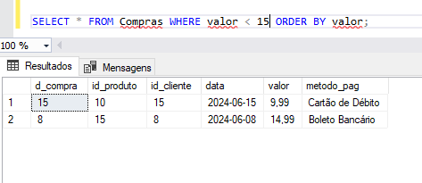

### Consulta 3: Consulta de Funcionários com Salário Menor que 4000:
```
SELECT * FROM Funcionarios WHERE salario < 4000;
```
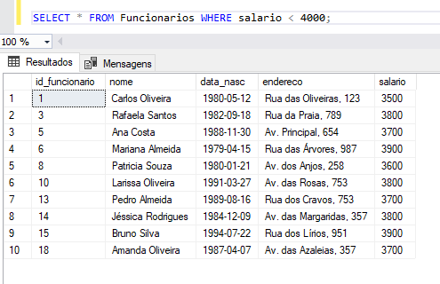

### Consulta 4:Consulta de Compras Pagas com Cartão de Crédito:
```
SELECT * FROM Compras WHERE metodo_pag = 'Cartão de Crédito';
```
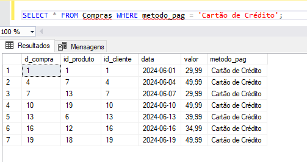

### Consulta 5: Consulta de Produtos em Estoque Baixo:
```
SELECT nome, qtde
FROM Produtos
WHERE qtde < 30;
```
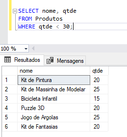

### Consulta 6: Consulta de Compras Realizadas em Dias da Semana:
```
SELECT DATENAME(dw, cp.data) AS dia_semana, COUNT(*) AS total_compras
FROM Compras cp
GROUP BY DATENAME(dw, cp.data)
ORDER BY total_compras DESC;
```
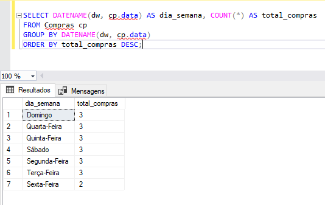

### Consulta 7: Selecionar dados por ordem alfabética
```
SELECT * FROM Produtos
ORDER BY nome;
```
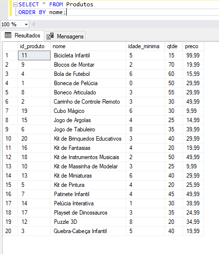

### Consulta 8: Consulta de Clientes por Mês de Aniversário:
```
SELECT *
FROM Clientes
WHERE MONTH(data_nasc) = 1;
```
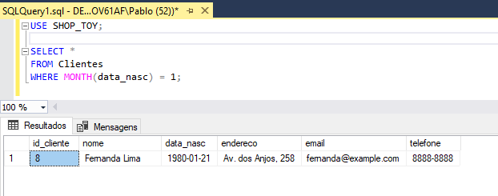

### Consulta 9: Consulta de Clientes por Faixa Etária:
```
SELECT *
FROM Clientes
WHERE YEAR(GETDATE()) - YEAR(data_nasc) BETWEEN 18 AND 30;
```
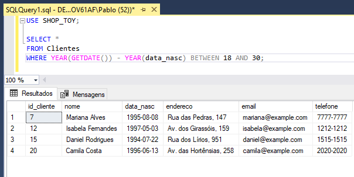

### Consulta 10: Clientes Nascidos Antes de 2000:
´´´
SELECT *
FROM Clientes
WHERE data_nasc < '2000-01-01';
´´´
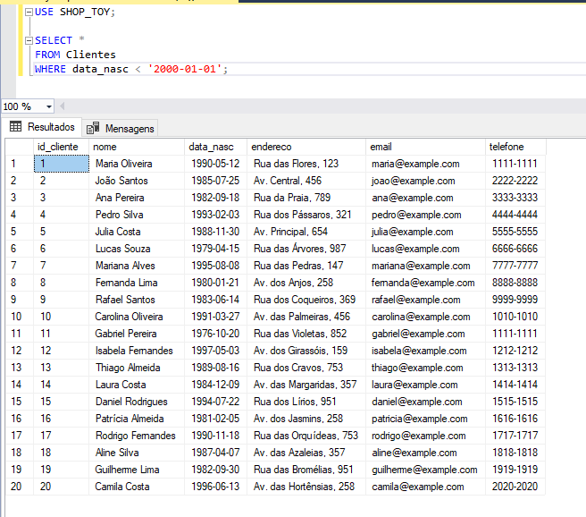
