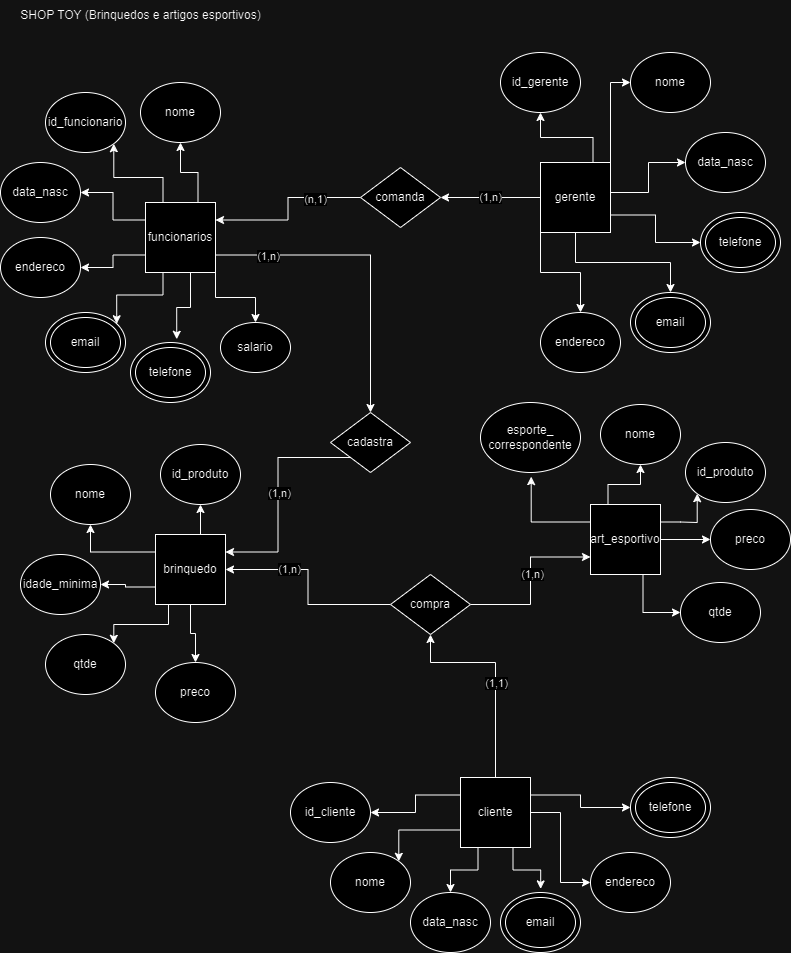

# Prova Banco De Dados
## 1- Cenário

Uma loja localizada no centro da cidade estava passando por alguns problemas financeiros. A loja se chama SHOP TOY, uma loja que é especializada em brinquedos dos mais diversos tipos (para crianças desde as menores até as mais crescidas) e também para um público mais velho alguns artigos esportivos (como bolas das mais variadas, chuteiras e etc).
 O seu gerente resolveu que para o melhor funcionamento da loja seria necessário um novo sistema de banco de dados, pois o que eles utilizavam além de ter vários problemas também não estava sendo muito utilizado pelos funcionários tendo em vista as suas falhas. 
Você foi contratado para criar este sistema de uma forma que facilite a manipulação de dados no sistema da loja.
Além disso, o novo sistema de banco de dados da loja SHOP TOY deve ser capaz de gerenciar não apenas as vendas de produtos, mas também o estoque de mercadorias, o registro de clientes, as informações dos funcionários e a performance financeira da loja.

O sistema deve ser capaz de registrar todas as transações de compra e venda de produtos, mantendo um registro detalhado do histórico de compras de cada cliente. Isso inclui informações como data da compra, produtos adquiridos, valor total da compra e método de pagamento utilizado.

Para otimizar a gestão do estoque, o sistema deve manter um registro atualizado de todos os produtos disponíveis na loja, incluindo informações como quantidade em estoque, preço de venda, idade mínima recomendada para o produto (se aplicável) e qualquer desconto ou promoção em vigor.

Além disso, o sistema deve permitir o cadastramento e atualização de informações dos clientes e funcionários incluindo nome, data de nascimento, endereço, e-mail e número de telefone

## 2- Modelo Conceitual

